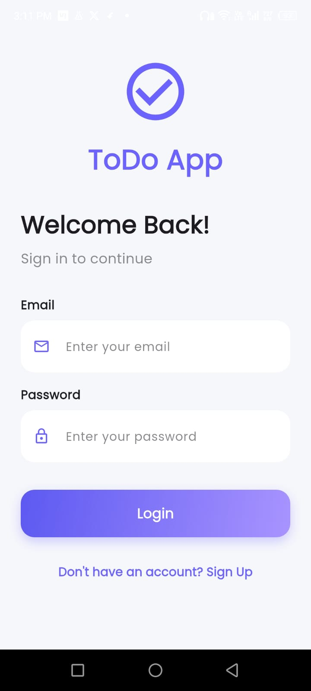
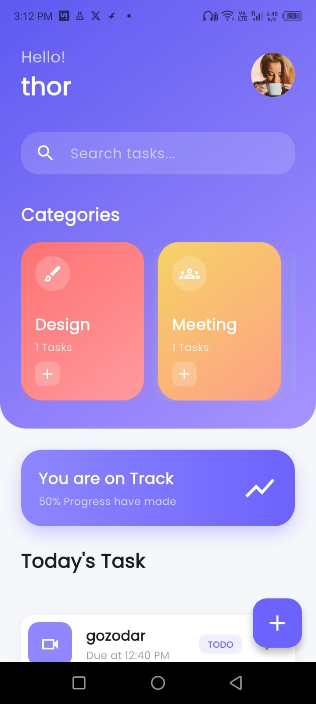
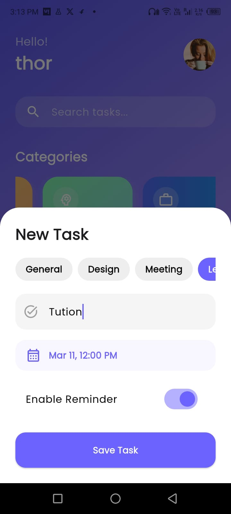
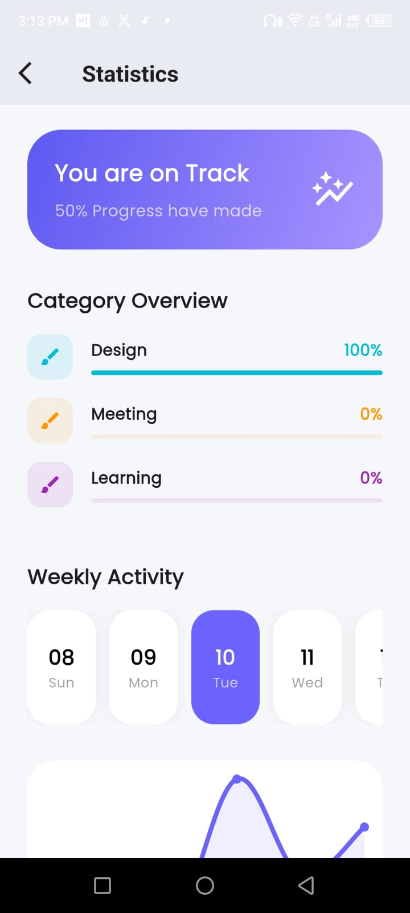

<div align="center">


<br/><br/>

# ✅ ToDo App

**A production-grade task management app built with Flutter & Firebase.**  
Clean architecture · Real-time sync · Smart notifications · Analytics dashboard

<br/>

[](https://github.com/siddhart3000/ToDo-App/releases/tag/v1.0)
&nbsp;
[](https://github.com/siddhart3000/ToDo-App)

</div>

---

## 📸 Screenshots

| Login | Dashboard | Tasks | Analytics | Dark Mode |
|:-----:|:---------:|:-----:|:---------:|:---------:|
|  |  |  |  | .jpeg) |

---

## ✨ Features

| Feature | Description |
|---------|-------------|
| 🔐 **Authentication** | Secure Firebase Email & Password login with session persistence |
| 📝 **Task Management** | Create, edit, delete, and toggle tasks between TODO / DONE |
| 📂 **Categories** | Work, Design, Meetings, Learning, Personal, Health, Shopping, Others |
| 🔎 **Smart Search** | Instant search with real-time dynamic filtering |
| 🔔 **Notifications** | Local reminders and smart due-date alerts |
| 📊 **Analytics** | Weekly charts, completion rates, and category-level performance |
| 🌙 **Dark Mode** | Material 3 design with seamless light/dark transitions |
| 👤 **Profile** | Update name, photo, phone number, and address |

---

## 🏗️ Architecture

This app follows a **layered clean architecture** pattern, keeping UI, business logic, and data concerns fully separated.

```
lib/
├── core/
│   ├── constants/          # App-wide constants
│   ├── theme/              # Material 3 light & dark themes
│   └── utils/              # Helper functions & extensions
│
├── models/
│   ├── task_model.dart     # Task data model
│   └── user_model.dart     # User profile model
│
├── providers/              # Riverpod state providers
│   ├── auth_provider.dart
│   └── task_provider.dart
│
├── services/               # Business logic & Firebase integration
│   ├── firebase_service.dart
│   ├── auth_service.dart
│   └── task_service.dart
│
├── screens/                # UI screens
│   ├── auth/
│   ├── home/
│   ├── analytics/
│   ├── profile/
│   └── add_task/
│
└── widgets/                # Reusable UI components
    ├── task_card.dart
    ├── category_card.dart
    └── custom_components.dart
```

**Data Flow:** `UI (Screens/Widgets)` → `Riverpod Providers` → `Services` → `Firebase (Auth · Realtime DB · Storage)`

---

## 🛠️ Tech Stack

| Layer | Technology |
|-------|------------|
| **Framework** | Flutter 3.19 — Material 3 |
| **State Management** | Riverpod |
| **Auth** | Firebase Authentication |
| **Database** | Firebase Realtime Database |
| **Storage** | Firebase Cloud Storage |
| **Charts** | fl_chart |
| **Notifications** | flutter_local_notifications |
| **Fonts** | google_fonts |
| **Image Picker** | image_picker + permission_handler |

---

## ⚙️ Getting Started

### Prerequisites

- Flutter SDK ≥ 3.0.0
- Dart SDK ≥ 3.0.0
- A Firebase project with Authentication, Realtime Database, and Storage enabled

### 1 · Clone the repository

```bash
git clone https://github.com/siddhart3000/ToDo-App.git
cd ToDo-App
```

### 2 · Install dependencies

```bash
flutter pub get
```

### 3 · Configure Firebase

Add your Firebase config files to the project:

```
android/app/google-services.json        ← Android
ios/Runner/GoogleService-Info.plist     ← iOS
```

Then update the database URL in `lib/services/task_service.dart`:

```dart
// Replace with your Firebase project's Realtime Database URL
const String databaseUrl = 'https://your-project-id-default-rtdb.firebaseio.com';
```

### 4 · Generate launcher icons *(optional)*

```bash
dart run flutter_launcher_icons
```

### 5 · Run the app

```bash
flutter run
```

---

## 📁 Project Structure — Key Files

```
TodoApp/
├── android/
│   └── app/google-services.json       ← Firebase Android config
├── ios/
│   └── Runner/GoogleService-Info.plist ← Firebase iOS config
├── lib/
│   └── ...                            ← Full source (see Architecture above)
├── screenshots/                       ← App screenshots
├── pubspec.yaml                       ← Dependencies
└── README.md
```

---

## 🤝 Contributing

Contributions, issues, and feature requests are welcome!

1. **Fork** the repository
2. **Create** your feature branch — `git checkout -b feature/your-feature`
3. **Commit** your changes — `git commit -m "feat: add your feature"`
4. **Push** to the branch — `git push origin feature/your-feature`
5. **Open** a Pull Request

Please follow the [Conventional Commits](https://www.conventionalcommits.org/) format and make sure your code passes `flutter analyze` before submitting.

---

## 📄 License

Distributed under the **MIT License**. See [`LICENSE`](LICENSE) for details.

---

<div align="center">

Made with ❤️ by **[Siddharth Singh](https://github.com/siddhart3000)**

*If this project helped you, please consider giving it a ⭐ — it means a lot!*

</div>

